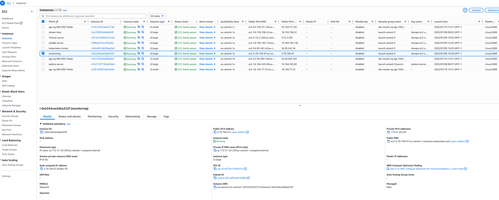
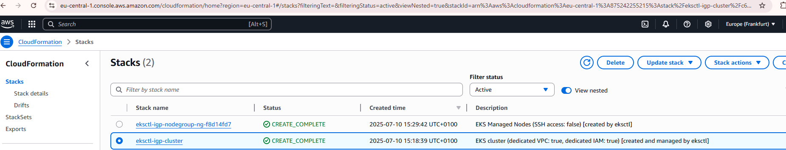
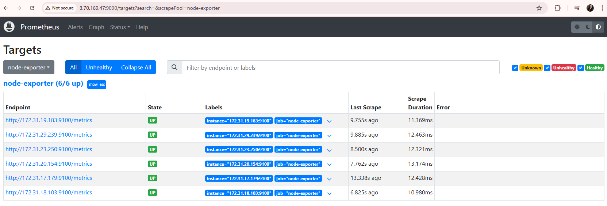
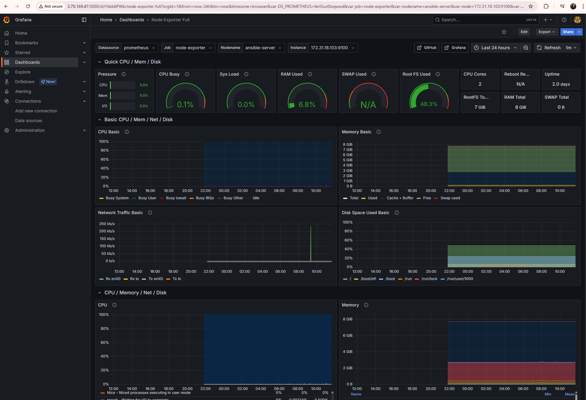
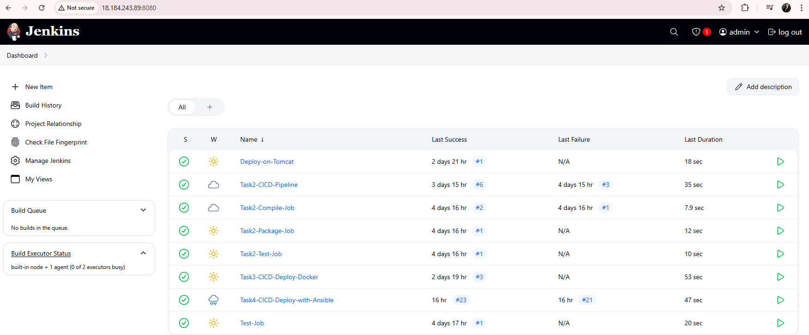

# DevOps Project – ABCtechnologies

This is the final Industry Graded Project for the DevOps Postgraduate Program. It implements a full CI/CD pipeline and monitoring infrastructure for a Java-based retail application. The solution leverages Jenkins, Tomcat, Docker, Ansible, Kubernetes (EKS), Prometheus, and Grafana, and is deployed across multiple AWS EC2 instances. The goal is to create a highly available, scalable, and automated deployment system with real-time monitoring.

## 🧩 Project Components Overview

- **Task 1** – Build and package Maven project inside Docker for isolation
- **Task 2** – Jenkins CI/CD pipeline for build, test, and packaging, using master-agent setup
- **Task 3** – Dockerization of the app and deployment via Jenkins to Docker host
- **Task 4** – Ansible playbooks to deploy to Docker and Kubernetes; Jenkins triggers end-to-end automation
- **Task 5** – Monitoring setup using Prometheus (scraping metrics from all EC2s) and Grafana (with dashboards)

## 📂 Repository Structure

See the [Ansible README](ansible/README.md) for detailed playbooks and setup guides.

---

## 🏗️ Architecture

### AWS Instances

  
*This creenshot shows the six EC2 instances provisioned for the DevOps stack plus three t1.small nodes in the k8s-cluster:*
- **docker-host**: Runs Docker (and cAdvisor)
- **tomcat-server**: Hosts the Java web application
- **ansible-host**: Used for automation and orchestration
- **jenkins-server**: CI/CD pipeline with Jenkins
- **monitoring**: Prometheus and Grafana services
- **kubernetes-cluster**: Three t1.small nodes created for Kubernetes workloads

> **Why multiple EC2 instances?**  
> While the assignment could have been implemented using only 1–2 EC2s, I chose to provision **one dedicated EC2 instance per host**. This allowed for:
> - clean separation of roles,
> - better simulation of production environments,
> - realistic troubleshooting (networking, SSH, permissions),
> - and clearer visibility when testing distributed DevOps workflows.

### Kubernetes Cluster via CloudFormation

  
*This screenshot shows the Kubernetes cluster created using AWS CloudFormation, automating the provisioning of three t1.small nodes and related resources for scalable container orchestration.*

### Prometheus & Node Exporter

  
*Prometheus scrapes metrics from Node Exporter running on all EC2 hosts, providing system-level monitoring.*

### Grafana Dashboard

  
*Grafana visualizes metrics from Prometheus, including system, Docker, JVM, and Jenkins dashboards.*

### Jenkins

  
*Jenkins is integrated for CI/CD automation and exposes metrics for monitoring.*

---

## 🧪 Tools Used

| Tool        | Purpose                         |
|-------------|---------------------------------|
| **GitHub**  | Version control, code sharing   |
| **Jenkins** | CI/CD pipeline automation       |
| **Docker**  | Containerization                |
| **Tomcat**  | Java web app runtime            |
| **Ansible** | Orchestration & deployment      |
| **EKS (k8s)**| App deployment at scale        |
| **Prometheus** | Resource and app monitoring |
| **Grafana** | Dashboarding and alerting       |

---

## 💡 What I’ve Learned

- How to isolate Maven builds in Docker for cleaner local environments
- How to create and manage Jenkins pipelines both via UI and `Jenkinsfile`
- The value of separating EC2 instances to simulate multi-host real-world architecture
- SSH hardening and user-role management between Jenkins, Ansible, Docker, and Kubernetes nodes
- The power of Ansible for remote Docker and Kubernetes orchestration
- How to troubleshoot and work around Docker Hub UI issues using CLI verification
- How to use Prometheus and Node Exporter for EC2 resource monitoring and visualize metrics with Grafana
- The importance of fallback strategies: when automation fails, manual steps can help keep the project on track
- How to document and structure a production-grade DevOps solution for evaluation and clarity

---

## 🧰 Local Setup Notes

I used **Visual Studio Code** as my main development IDE, along with:
- an **integrated terminal**, and
- a separate **WSL Ubuntu terminal** on my local machine.

This dual-terminal setup provided flexibility and explains any slight differences in terminal output formatting across screenshots and logs.

Additionally, Eclipse-specific configuration files were ignored using `.gitignore`, as my environment was tailored to VS Code.

---

## 🔗 GitHub Links

- Main repo: [https://github.com/lien-nguyen/igp-abctech](https://github.com/lien-nguyen/igp-abctech)
- Ansible details: [ansible/README.md](ansible/README.md)

---

Thank you for reviewing this project!
