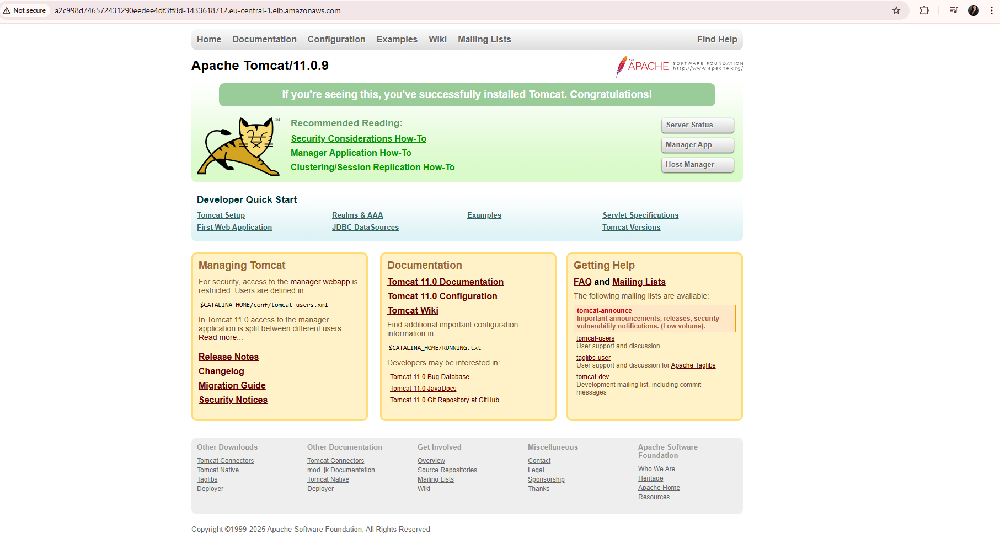
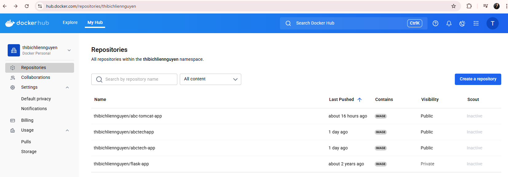

# DevOps Project - ABCtechnologies Monitoring & Automation 

This is a final DevOps project that implements a complete automation-deplyment stack for a web app and monitoring for multiple AWS EC2 instances. The solution uses Prometheus, Node Exporter, Grafana, Jenkins, Docker, Kubernetes (Amazon EKS) and Ansible to provide automated deployment, CI/CD, and real-time system and application monitoring across the infrastructure.

## Project Overview

- **Automated monitoring** of system, Docker, JVM, and Jenkins metrics across all EC2 hosts
- **Prometheus** scrapes metrics from all configured targets
- **Grafana** provides dashboards for live visualization
- **Node Exporter** (and **cAdvisor**) collect system and container metrics
- **Jenkins** integrated for CI/CD pipeline automation
- **Ansible** automates the deployment process to k8s
- **EKS** deploys the web app to k8s

## Architecture

### AWS Instances

*This diagram shows the six EC2 instances provisioned for the DevOps stack plus three t1.small nodes in the k8s-cluster:*
- **docker-host**: Runs Docker (and cAdvisor)
- **tomcat-server**: Hosts the Java web application
- **ansible-host**: Used for automation and orchestration
- **jenkins-server**: CI/CD pipeline with Jenkins
- **monitoring**: Prometheus and Grafana services
- **kubernetes-cluster**: Three t1.small nodes created for Kubernetes workloads

### Kubernetes Cluster via CloudFormation

*This diagram shows the Kubernetes cluster created using AWS CloudFormation, automating the provisioning of three t1.small nodes and related resources for scalable container orchestration.*

### Prometheus & Node Exporter

*Prometheus scrapes metrics from Node Exporter running on all EC2 hosts, providing system-level monitoring.*

### Grafana Dashboard

*Grafana visualizes metrics from Prometheus, including system, Docker, JVM, and Jenkins dashboards.*

### Jenkins

*Jenkins is integrated for CI/CD automation and exposes metrics for monitoring.*

### Tomcat

*Tomcat hosts the Java web application and exposes JVM metrics for Prometheus.*

### DockerHub

*Docker images are built and pushed to DockerHub for deployment across the stack.*

## Documentation

For detailed setup, playbooks, and usage instructions, see the [Ansible README](ansible/README.md).
